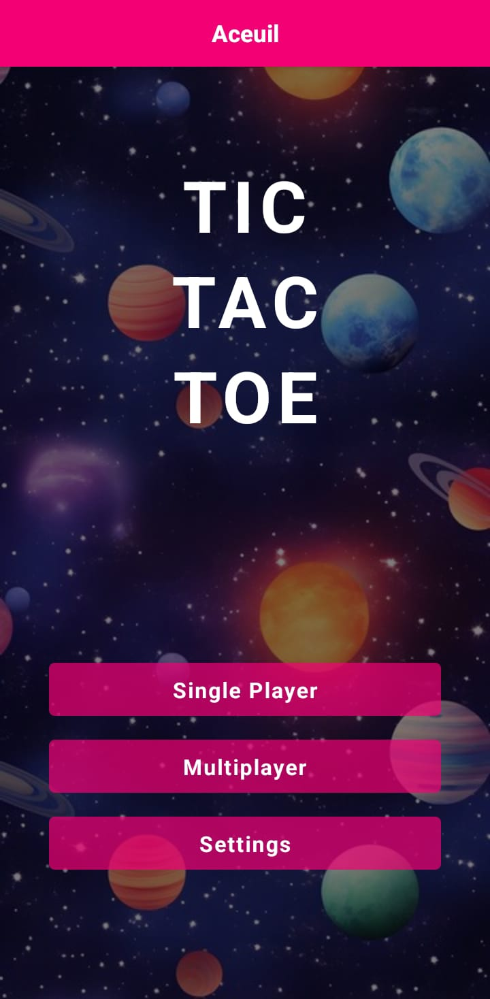
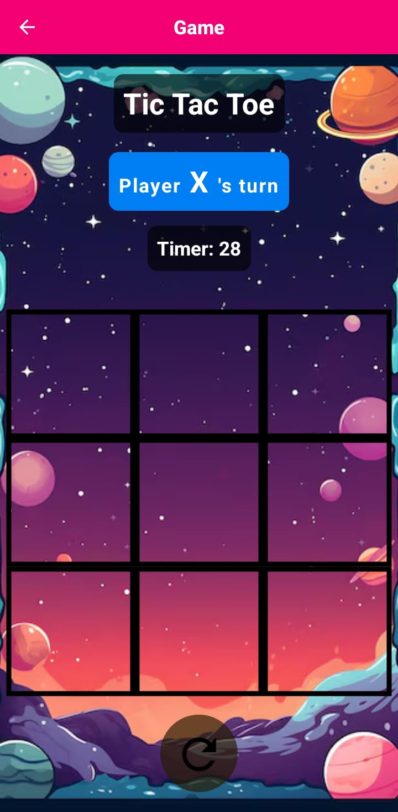

# Tic Tac Toe

## Description
This is a simple Tic Tac Toe game developed in React Native using Expo.

## How to run
1. Clone the repository
2. Run `npm install` to install the dependencies
3. Run `npm start` to start the Expo server
4. Scan the QR code with the Expo app on your phone or run it on an emulator

## How to play
1. The game starts with Player 1 (X) and Player 2 (O)
2. Tap on an empty cell to place your mark
3. The game will automatically switch to the next player
4. The game will end when a player wins or when the board is full

## Screenshots

